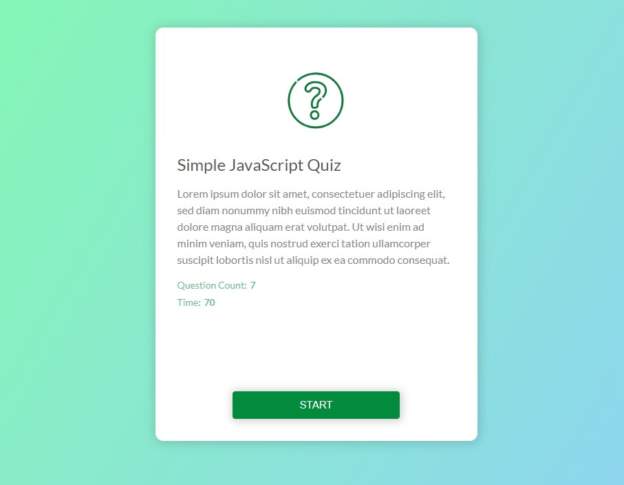

## Simple Web Projects with Pure Javascript
A collection of simple web projects developed for enthusiasts and beginners. The main purpose is education and all the codes are open for everyone that needs it.

**Notes:**
* Webpack, gulp or another bundler was not used.
* Third party libraries were not used.
* Codes only supported by modern browsers.
* Projects just are for educational purposes.

### Running locally
It's so simple. Clone or download the repository, open project directory and click `index.html`. As I mentioned above, there is not any bundler and all scripts have been injected in the HTML.

## Projects
There are 6 developed project that you can review now.
  - [Custom Video Player](#custom-video-player)
  - [Lovely Movies](#lovely-movies)
  - [Note App](#note-app)
  - [Othello Board Game](#othello-board-game)
  - [Quiz App](#quiz-app)
  - [Simple Range Slider](#simple-range-slider)
 
### Custom Video Player
In this project I customized the video controls and designed them manually. Focus on handling the video node and how to implement custom behavior for it.

**Special topics covered:**
- Video node controls
- Fullscreen handling
- CSS variables

 
### Lovely Movies
A simple movie search website

**Special topics covered:**
- Promises and Fetch data with API
- Control DOM behaviors and events
- Usage of `position: static;` in CSS
- Using CSS variables

 
### Note App
A practical note web app to handle categorized notes. There are notes that can have a category for. you can search in notes and edit or remove those.

**Special topics covered:**
- Object Oriented Programming (OOP)
- Creating DOM elements
- Layouting with CSS grid system

### Othello Board Game
Famous strategy game Othello, known as Reversi, implemented in pure Javascript.

**Special topics covered:**
- Object Oriented Programming (OOP)
- Othello game strategy
- Creating DOM elements
- Event handling
- Error handling

### Quiz App
Simulating a quiz in web app.

**Special topics covered:**
- Object Oriented Programming (OOP)
- Creating and handling DOM elements
- CSS animation

### Simple Range Slider
Simple implementation of a small range slider with pure Javascript.

**Special topics covered:**
- Prototypal Object-Oriented Programming
- DOM events handling 
- CSS variables

### New projects are being prepared
I try to make this repo very useful. So, I really looking forward to your help and your criticism.
